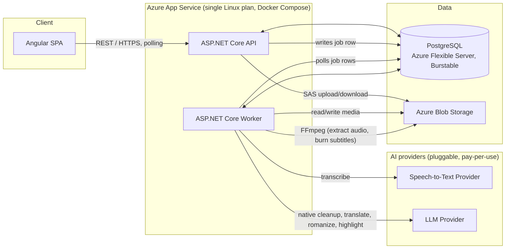

# Architecture

## 0. Design priorities

This architecture optimizes for **low fixed cost at low traffic** and for
the **AI pipeline being the product**, not a bolt-on. Two consequences
follow through every decision below:

1. **No managed service is used unless it removes real risk (mainly: data
   durability) or genuinely can't be replicated cheaply.** We do not
   provision a message queue, a real-time push service, a secrets vault, a
   container registry, or a CDN just because a larger-scale reference
   architecture would have one. PostgreSQL and the application containers
   do that work instead. See §6 for exactly what is and isn't provisioned,
   and why.
2. **Speech-to-text and the LLM are accessed through small provider
   interfaces, not hard-wired to one vendor.** Every AI call is logged with
   which provider/model/prompt version produced it (§3). This is what
   makes the product "AI-first": the AI pipeline is a first-class,
   inspectable, versioned subsystem — not an opaque call buried in a
   worker method.

We stay on Azure (per the original stack requirement) but use it narrowly:
one compute host, one Postgres instance, one Blob Storage account. Nothing
here assumes traffic beyond "a handful of creators uploading videos
occasionally" — see §7 for what changes if that stops being true.

## 1. Overview



The API and Worker are two containers in one Docker Compose file, deployed
to a single Azure App Service (Linux, multi-container). There is no
message broker between them: the API writes a row to the `processing_jobs`
table (see [Database.md](Database.md) §2.9) and the Worker polls that
table. At MVP traffic levels this is simpler and cheaper than Service Bus
and loses nothing — see §6.2 for why.

## 2. Components

### 2.1 Angular SPA (`Subtitles.Web`)

- Upload UI (direct-to-blob upload via SAS URL — the API never proxies
  video bytes; this is the one place a "bigger" pattern is kept, because
  routing large file uploads through the API container would otherwise
  size the compute plan around upload bandwidth instead of processing
  work).
- Subtitle editor: cue list, per-output-type view switch (native / English
  / romanized), inline cue text correction, per-word highlight toggle.
- Processing status via **polling** (`GET /videos/{id}` every few seconds
  while a video is not yet `Ready`). No push channel — see §6.3.
- Export panel (SRT/VTT download, burned-in video export request), and a
  small "generated by" detail per output showing the AI provenance fields
  from §3 (useful for creators who want to know why a line reads oddly,
  and essential for us when triaging quality issues).
- Served as a static build from the same App Service as the API (no CDN
  at MVP scale — see §6.5).

### 2.2 ASP.NET Core API (`Subtitles.Api`)

- AuthN/authZ (ASP.NET Core Identity + JWT bearer tokens).
- Video lifecycle endpoints: create upload session, confirm upload,
  list/get/delete videos.
- Subtitle read/edit endpoints, including the provenance fields from §3.
- Export endpoints.
- On `POST /videos/{id}/complete`, inserts an `ExtractAudio` row into
  `processing_jobs` (`status = Queued`). Does not call FFmpeg or any AI
  provider directly — all of that is the Worker's job, so the API tier
  stays fast and cheap to run.

Full contract: [API.md](API.md).

### 2.3 ASP.NET Core Worker (`Subtitles.Worker`)

A hosted background service that polls `processing_jobs` on an interval
(e.g. every 2–5 seconds — cheap at low volume; tune up only if queue
latency becomes noticeable) using:

```sql
SELECT * FROM processing_jobs
WHERE status = 'Queued' AND available_at <= now()
ORDER BY created_at
LIMIT 1
FOR UPDATE SKIP LOCKED;
```

`FOR UPDATE SKIP LOCKED` is what makes this safe to run with more than one
worker instance later without a real queue — two workers polling
concurrently will never grab the same row. Failed jobs get a backoff by
pushing `available_at` into the future and incrementing an attempt count,
rather than a dead-letter queue.

Pipeline stages, each a distinct `job_type`, run **strictly in sequence**
per video (not fanned out in parallel — see rationale in §4):

1. **ExtractAudio** — FFmpeg: source video (from Blob Storage) → mono
   16kHz WAV, uploaded back to Blob Storage.
2. **Transcribe** — send audio to the configured Speech-to-Text Provider
   (§3.1). Produces the raw native-language transcript with word-level
   timestamps and a detected language code. This raw transcript is
   intentionally *not* shown to the creator — ASR output is rarely clean
   enough to publish directly, which is why the next stage exists.
3. **NativeCleanup** (LLM) — the raw transcript is cleaned up (punctuation,
   casing, disfluency removal, natural cue segmentation) by the LLM
   Provider (§3.2) and becomes the **Native** subtitle track. This is the
   subtitle text a creator actually sees and edits.
4. **TranslateToEnglish** (LLM) — the cleaned Native cues are translated to
   English, cue-for-cue, producing the **English** track.
5. **Romanize** (LLM) — the cleaned Native cues are transliterated to Latin
   script, cue-for-cue, producing the **Romanized** track.
6. **GenerateHighlights** (LLM) — the cleaned Native cues are analyzed to
   flag important words; flags are stored per word on the Native track and
   propagated to the corresponding words in the English and Romanized
   tracks (see [Database.md](Database.md) §2.7).
7. *(Creator edits cue text / highlights interactively — not a queued job;
   handled synchronously by the API, see [UserFlows.md](UserFlows.md).)*
8. **Export** (on demand) — SRT/VTT rendering, or FFmpeg burn-in of
   subtitles into the source video, honoring highlight styling.

Stages 3–6 run against the LLM Provider **in that order because each
downstream stage depends on the cleaned Native text**, not the raw ASR
output — translating or romanizing directly from raw, unpunctuated ASR
text would bake transcription noise into two more languages instead of
fixing it once. This is a deliberate departure from a design that would
translate/romanize/highlight in parallel: correctness (not cleaning ASR
errors twice) is prioritized over the small latency win parallelizing
would give.

### 2.4 Idempotency and retries

Every stage is safe to re-run for the same video: `ExtractAudio` re-derives
`audio_blob_path`, `NativeCleanup`/`TranslateToEnglish`/`Romanize` each
overwrite their track's cues rather than appending, and `GenerateHighlights`
only ever rewrites `is_highlighted_auto` (never a creator's manual
override — see [Database.md](Database.md) §2.7). This is what makes the
`processing_jobs` retry-with-backoff mechanism (§2.3) safe: a job that
fails partway through and gets retried produces the same result as if it
had succeeded on the first attempt, not a duplicate or a corrupt partial
state.

### 2.5 Data stores

- **PostgreSQL** — all structured state, including the job queue itself:
  accounts, users, videos, transcripts, subtitle tracks/cues/words,
  exports, prompt versions, AI generation provenance, and processing jobs.
  See [Database.md](Database.md).
- **Azure Blob Storage** — binary artifacts only: source videos, extracted
  audio, exported subtitle files, burned-in video exports.

## 3. The AI pipeline (core subsystem)

This is the part of the system that makes the product what it is, so it's
documented as its own subsystem rather than folded into "the worker does
some AI calls."

### 3.1 Speech-to-Text Provider

```csharp
public interface ISpeechToTextProvider
{
    string ProviderName { get; }   // e.g. "openai"
    string ModelName { get; }      // e.g. "whisper-1"

    Task<TranscriptionResult> TranscribeAsync(Stream audio, CancellationToken ct);
}

public record TranscriptionResult(
    string Text,
    string LanguageCode,
    double LanguageConfidence,
    IReadOnlyList<WordTimestamp> Words);
```

**MVP default:** a pay-per-use hosted transcription API (e.g. OpenAI's
Whisper API, or a comparable per-minute-billed provider) rather than
self-hosting an open-source ASR model. At the traffic this product expects
("we do not expect such traffic"), a self-hosted model would mean paying
for compute that sits idle almost all the time; a pay-per-minute API costs
roughly cents per video and scales to zero when nobody's uploading. If
volume grows enough that per-minute pricing stops being the cheaper
option, §7 covers the switch to self-hosting — the interface above is what
makes that swap a config change, not a rewrite.

### 3.2 LLM Provider

```csharp
public interface ILlmProvider
{
    string ProviderName { get; }   // e.g. "openai"
    string ModelName { get; }      // e.g. "gpt-4o-mini"

    Task<string> CompleteAsync(string renderedPrompt, CancellationToken ct);
}
```

**MVP default:** a low-cost hosted small/mid-tier model (e.g. a
GPT-4o-mini-class or equivalent model chosen at implementation time by
comparing current per-token pricing and Telugu/Hindi quality). The same
"pay-per-use beats idle compute at this traffic" reasoning as §3.1 applies
— self-hosting an open-source LLM would mean provisioning a GPU-capable
host running continuously for occasional bursts of work.

One `ILlmProvider` call is made per stage (NativeCleanup, TranslateToEnglish,
Romanize, GenerateHighlights) per video — four calls total, not one giant
call — because each stage has its own prompt, its own versioning, and its
own ability to be independently re-run (§3.3, and the Phase 2 "resync a
single track" feature in [Roadmap.md](Roadmap.md)).

### 3.3 Prompt registry and versioning

Prompts are not hard-coded strings in the worker — they're rows in a
`prompt_versions` table (see [Database.md](Database.md) §2.10), one
task per row: `NativeCleanup`, `TranslateToEnglish`, `Romanize`,
`GenerateHighlights`. Exactly one version per task is marked active at a
time; the worker always renders the **active** version's template for
each call. Publishing a better prompt is a new row + flipping
`is_active`, not a deployment.

### 3.4 Generation provenance

Every AI-produced artifact must be traceable to exactly what produced it.
Each pipeline run writes one row per stage to `ai_generations` (see
[Database.md](Database.md) §2.11) with:

| Field | Populated for |
|---|---|
| Speech Provider | `Transcribe` stage |
| Speech Model | `Transcribe` stage |
| LLM Provider | `NativeCleanup`, `TranslateToEnglish`, `Romanize`, `GenerateHighlights` |
| LLM Model | same four LLM stages |
| Prompt Version | same four LLM stages |
| Generation Timestamp | every stage |
| Reason | every stage — `initial`, `manual_regeneration`, or `prompt_upgrade_reprocess` |

This directly answers the question that motivates it: when a prompt is
improved, `SELECT video_id FROM ai_generations WHERE stage =
'TranslateToEnglish' AND prompt_version_id = <old version>` tells you
exactly which videos' English subtitles were produced by the old prompt
and are candidates for regeneration. The API surfaces the same fields per
track (see [API.md](API.md) §3) so a creator — or a support engineer — can
see them without a database query.

## 4. Sequential vs. parallel pipeline

Earlier drafts of this document fanned Translate/Transliterate/Highlight
out in parallel against separate Azure Cognitive Services. That's gone,
for two reasons: it required a message queue to coordinate the fan-out
(see §6.2), and it meant translation and romanization each independently
inherited raw ASR noise instead of a single cleaned transcript. The
sequential pipeline in §2.3 costs a few extra seconds of end-to-end
latency per video — acceptable, since nothing about this product is
real-time — in exchange for a simpler runtime (no coordination logic) and
better output quality (errors get fixed once, upstream, instead of three
times).

## 5. Media processing (FFmpeg)

Unchanged in role from a conventional design: FFmpeg runs as a subprocess
inside the Worker container for audio extraction (stage 1), subtitle
burn-in export, and metadata probing on upload. It is not swapped out for
anything — there's no cheaper or simpler way to do audio extraction and
burn-in than the tool built for it.

## 6. What's deliberately *not* in this architecture, and why

Each of these appears in a typical "enterprise" Azure reference
architecture. Each is omitted here on purpose.

### 6.1 Azure Container Apps / AKS
A single Azure App Service (Linux, multi-container) running the Docker
Compose file (API + Worker) is enough at this traffic and is billed as one
small App Service Plan instead of a cluster control plane. Revisit only
if independent auto-scaling of API vs. Worker becomes necessary (§7).

### 6.2 Azure Service Bus
The `processing_jobs` table with `FOR UPDATE SKIP LOCKED` polling (§2.3)
gives at-least-once delivery, retry-with-backoff, and safety under
multiple worker instances — the properties a queue exists to provide —
without a second billed resource or a second thing to operate. This is
the single biggest simplification versus a scaled-out design.

### 6.3 Azure SignalR Service
Processing a video takes on the order of tens of seconds to a few
minutes; polling `GET /videos/{id}` every few seconds gives the creator
status updates that feel live without a persistent-connection service
billed by concurrent connections. Revisit only if the product grows a
feature that genuinely needs sub-second push (not in scope — see
[Roadmap.md](Roadmap.md)).

### 6.4 Azure Key Vault
Secrets (DB connection string, Blob Storage key, AI provider API keys)
are set as App Service Application Settings, which Azure encrypts at
rest and injects as environment variables — no separate vault resource
or SDK dependency needed at this scale. Revisit if compliance
requirements (not currently stated) demand vault-backed secret rotation.

### 6.5 Azure CDN / Front Door
The Angular static build is served directly from the App Service. At low
traffic, the latency/caching benefit of a CDN doesn't justify a second
resource; add one later if global audience latency becomes a real
complaint, not preemptively.

### 6.6 Azure Container Registry
Container images are pushed to GitHub Container Registry (free for this
use case) instead of a billed Azure registry. Deployment pulls from
there.

### 6.7 Application Insights / full APM
Structured logs go to stdout, captured by App Service's built-in (free)
log stream. No separate APM product for MVP — there's one API container
and one Worker container; correlating a video's progress across the
`processing_jobs` and `ai_generations` tables is sufficient for debugging
at this scale without distributed tracing infrastructure.

### 6.8 What we kept, and why

- **Azure Database for PostgreSQL, Flexible Server (Burstable B1ms)** —
  the one managed data-tier service kept. Self-hosting Postgres in a
  container on the same App Service would save roughly the cost of this
  tier, but would put the durability of every creator's account, videos,
  and edits behind manual backup discipline. That trade isn't worth the
  saving — a Burstable instance's automated backups are cheap insurance
  relative to what a lost database costs the business. If you want to
  challenge this trade-off specifically, it's the one place in this
  document worth re-discussing before committing.
- **Azure Blob Storage** — genuinely the cheapest and simplest way to
  store large binary video files with direct-upload (SAS URL) support;
  there's no lower-cost alternative that doesn't mean building upload
  handling into the API tier.

## 7. Rough cost shape (order of magnitude, not a quote)

| Component | Approx. monthly cost at MVP traffic |
|---|---|
| App Service, Linux, B1 (API + Worker containers) | ~$13 |
| Azure Database for PostgreSQL, Burstable B1ms | ~$12–15 |
| Azure Blob Storage (low GB, low transactions) | ~$1–5 |
| Speech-to-Text API (pay-per-minute, occasional uploads) | usage-based, likely single-digit $ |
| LLM API (pay-per-token, 4 short calls/video) | usage-based, likely single-digit $ |

Total: roughly **$30–40/month fixed** plus a small usage-based AI cost that
scales with how many videos are actually processed — not with idle time.
This is the number to revisit if actual usage patterns diverge from "we do
not expect such traffic."

## 8. When to revisit this architecture

None of the omissions in §6 are permanent decisions — they're "not yet."
Concrete triggers to reconsider each:

- **Job queue (§6.2):** if polling latency or Postgres contention from the
  worker's polling loop becomes measurable, move `processing_jobs` polling
  to Service Bus — the job payload shape doesn't need to change, only how
  it's dequeued.
- **Real-time push (§6.3):** if a feature needs genuinely live updates
  (e.g. collaborative editing, [Roadmap.md](Roadmap.md) Phase 4).
- **Self-hosted AI (§3.1, §3.2):** if per-video AI provider cost, at actual
  observed volume, exceeds what a continuously-running GPU host would
  cost — do the math with real usage numbers before switching, don't
  pre-optimize for it.
- **Independent scaling of API vs. Worker (§6.1):** if video processing
  volume grows enough that the Worker needs to scale independently of API
  request traffic.

## 9. Local development

Docker Compose runs `Subtitles.Api`, `Subtitles.Worker`, and PostgreSQL
locally. Azure Blob Storage is emulated with
[Azurite](https://learn.microsoft.com/azure/storage/common/storage-use-azurite).
The Speech-to-Text and LLM providers have no meaningful local emulator —
local development calls the real (dev-tier / low-usage-key) provider
APIs, same as production, just pointed at cheap/free-tier keys. Angular
runs via its own dev server (`ng serve`) against the local API.
