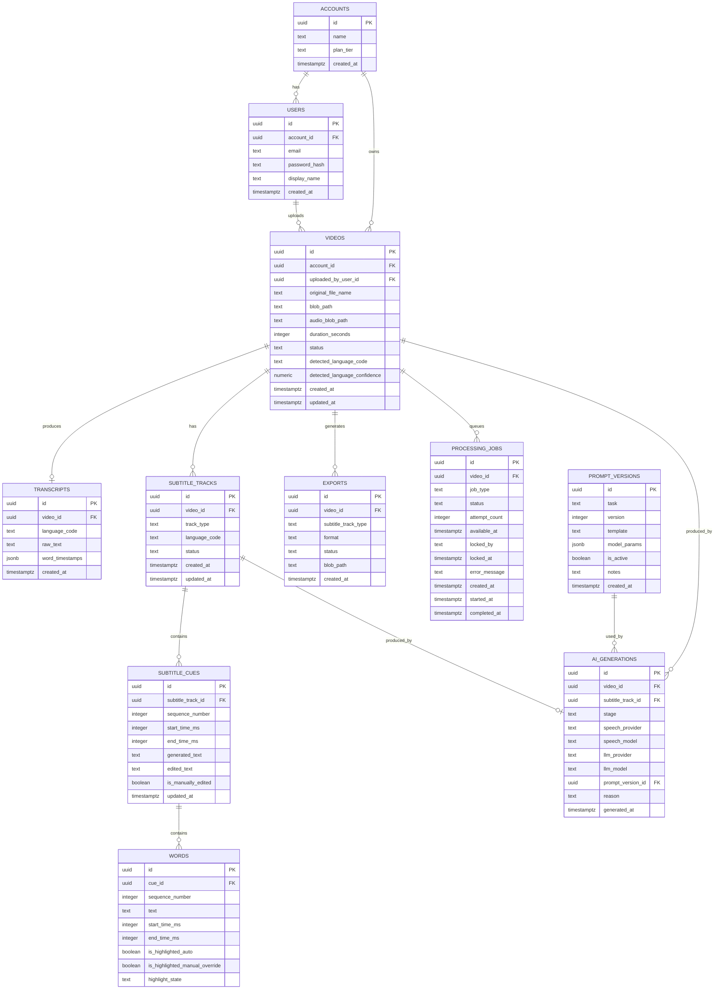

# Database

PostgreSQL is the system of record for all structured state — including,
by design, the background job queue itself (see
[Architecture.md](Architecture.md) §6.2: there is no separate message
broker). Binary media (source videos, extracted audio, exported files) is
never stored in the database — tables hold Azure Blob Storage paths/URLs
instead.

## 1. Entity-relationship diagram

## 2. Table reference

### 2.1 `accounts`

The billing/ownership boundary. A single-user MVP account and a future
team/org account are the same shape, so multi-user accounts don't require
a schema migration later.

| Column | Type | Notes |
|---|---|---|
| `id` | uuid PK | |
| `name` | text | Display name for the account. |
| `plan_tier` | text | e.g. `free`, `pro`. Not enforced anywhere in MVP — informational only until billing exists. |
| `created_at` | timestamptz | |

### 2.2 `users`

| Column | Type | Notes |
|---|---|---|
| `id` | uuid PK | |
| `account_id` | uuid FK → accounts | |
| `email` | text, unique | Login identifier. |
| `password_hash` | text | ASP.NET Core Identity-managed. |
| `display_name` | text | |
| `created_at` | timestamptz | |

### 2.3 `videos`

The central entity representing one uploaded video and its processing
state. `status` is kept deliberately coarse — per-stage detail lives in
`processing_jobs` (§2.9) and per-track detail in `subtitle_tracks` (§2.5),
not as ever-more values on this column.

| Column | Type | Notes |
|---|---|---|
| `id` | uuid PK | |
| `account_id` | uuid FK → accounts | Denormalized from `uploaded_by_user_id` for simpler access-control queries. |
| `uploaded_by_user_id` | uuid FK → users | |
| `original_file_name` | text | As uploaded, for display. |
| `blob_path` | text | Source video location in Blob Storage. |
| `audio_blob_path` | text, nullable | Extracted audio, set after the `ExtractAudio` stage. |
| `duration_seconds` | integer, nullable | Populated once probed. |
| `status` | text | One of: `Uploaded`, `Processing`, `Ready`, `Failed`. |
| `detected_language_code` | text, nullable | BCP-47 code (e.g. `te`, `hi`), set after the `Transcribe` stage. |
| `detected_language_confidence` | numeric, nullable | From the Speech-to-Text Provider (see [Architecture.md](Architecture.md) §3.1). |
| `created_at` / `updated_at` | timestamptz | |

### 2.4 `transcripts`

The raw output of the `Transcribe` stage — one per video (one-to-one, not
one-to-many; re-transcription replaces this row). This is the *raw* ASR
output, intentionally never shown to creators directly — the `NativeCleanup`
LLM stage turns it into the `Native` subtitle track (§2.5/§2.6).

| Column | Type | Notes |
|---|---|---|
| `id` | uuid PK | |
| `video_id` | uuid FK → videos, unique | |
| `language_code` | text | Detected/confirmed source language. |
| `raw_text` | text | Full plain-text raw transcript, pre-cleanup. |
| `word_timestamps` | jsonb | Array of `{ text, start_ms, end_ms }` as returned by the Speech-to-Text Provider, prior to LLM cleanup and cue segmentation. Kept for re-processing without re-calling the speech provider. |
| `created_at` | timestamptz | |

Provenance (which speech provider/model produced this) is **not** stored
as columns here — it's in `ai_generations` (§2.11), keyed to this video
with `stage = 'Transcribe'`, so all AI provenance lives in one place.

### 2.5 `subtitle_tracks`

One row per (video, output type). Exactly three rows per fully-processed
video: `Native`, `English`, `Romanized`. Every track, including `Native`,
is now LLM-produced (`Native` via the `NativeCleanup` stage) — see
[Architecture.md](Architecture.md) §2.3.

| Column | Type | Notes |
|---|---|---|
| `id` | uuid PK | |
| `video_id` | uuid FK → videos | |
| `track_type` | text | `Native` \| `English` \| `Romanized`. |
| `language_code` | text | Target language/script code (native's matches the video's detected language; English is always `en`; Romanized is the native language code with a script hint, e.g. `te-Latn`). |
| `status` | text | `Pending`, `Ready`, `Failed` — independent per track. Since stages now run sequentially (§ Architecture 2.3), `English`/`Romanized` cannot reach `Ready` before `Native` does, but each can still fail independently without rolling back the others. |
| `created_at` / `updated_at` | timestamptz | |

Unique constraint on (`video_id`, `track_type`).

### 2.6 `subtitle_cues`

The lines of a subtitle track. Cue **timing** is authoritative on the
`Native` track's cues (set during `NativeCleanup` segmentation);
`English`/`Romanized` cues share the same `sequence_number`/timing by
construction, since both are produced cue-for-cue from the already-
segmented Native cues.

| Column | Type | Notes |
|---|---|---|
| `id` | uuid PK | |
| `subtitle_track_id` | uuid FK → subtitle_tracks | |
| `sequence_number` | integer | Order within the track; matches across tracks for the same video. |
| `start_time_ms` / `end_time_ms` | integer | |
| `generated_text` | text | Original machine-generated text — never overwritten, kept for diffing/reset-to-original. |
| `edited_text` | text, nullable | Set when a creator manually corrects the line; null means "use `generated_text`". |
| `is_manually_edited` | boolean | Derived convenience flag (`edited_text is not null`), kept as a real column for cheap filtering. |
| `updated_at` | timestamptz | |

### 2.7 `words`

Word-level breakdown of a cue, used for highlight rendering. Populated by
the `GenerateHighlights` LLM stage for the Native track, then propagated
to the corresponding words in English/Romanized cues.

| Column | Type | Notes |
|---|---|---|
| `id` | uuid PK | |
| `cue_id` | uuid FK → subtitle_cues | |
| `sequence_number` | integer | Order within the cue. |
| `text` | text | The word/token as rendered in this track's language. |
| `start_time_ms` / `end_time_ms` | integer, nullable | Populated on the Native track from ASR word timestamps carried through cleanup; may be null on English/Romanized where a clean word-level time alignment doesn't exist. |
| `is_highlighted_auto` | boolean | Set by the `GenerateHighlights` pipeline stage. |
| `is_highlighted_manual_override` | boolean, nullable | `true` = creator forced highlight on, `false` = creator forced it off, `null` = no manual override, defer to `is_highlighted_auto`. |
| `highlight_state` | text, generated/derived | `Highlighted` or `NotHighlighted`, resolved from the two columns above; exposed to the API/frontend as the single field they need. |

Storing auto and manual state as separate columns (rather than one
mutable "is highlighted" flag) is what makes manual edits survive
re-runs of `GenerateHighlights`: re-running that stage only ever rewrites
`is_highlighted_auto`, never `is_highlighted_manual_override`.

### 2.8 `exports`

A generated, downloadable artifact for a video.

| Column | Type | Notes |
|---|---|---|
| `id` | uuid PK | |
| `video_id` | uuid FK → videos | |
| `subtitle_track_type` | text | Which output type this export renders (`Native`/`English`/`Romanized`); null/`N/A` for a burned-in export that includes its own choice baked in. |
| `format` | text | `SRT`, `VTT`, `BurnedInMp4`. |
| `status` | text | `Pending`, `Ready`, `Failed`. |
| `blob_path` | text, nullable | Set once `Ready`. |
| `created_at` | timestamptz | |

### 2.9 `processing_jobs`

**This table is the job queue**, not just an audit log — see
[Architecture.md](Architecture.md) §2.3 and §6.2. The Worker polls it
directly with `SELECT ... FOR UPDATE SKIP LOCKED`; there is no Service
Bus or other broker.

| Column | Type | Notes |
|---|---|---|
| `id` | uuid PK | |
| `video_id` | uuid FK → videos | |
| `job_type` | text | `ExtractAudio`, `Transcribe`, `NativeCleanup`, `TranslateToEnglish`, `Romanize`, `GenerateHighlights`, `Export`. |
| `status` | text | `Queued`, `Running`, `Succeeded`, `Failed`. |
| `attempt_count` | integer | Incremented on each retry; a job exceeding a configured max attempt count stays `Failed` and surfaces to the creator as retryable from the UI (see [UserFlows.md](UserFlows.md) §9). |
| `available_at` | timestamptz | Row is only eligible to be picked up when `available_at <= now()`. Set to `now()` on enqueue; pushed forward (backoff) on retry. |
| `locked_by` | text, nullable | Worker instance identifier while `status = Running`; cleared on completion/failure. Exists so a crashed worker's row can be detected (locked but stale) and requeued. |
| `locked_at` | timestamptz, nullable | |
| `error_message` | text, nullable | |
| `created_at` / `started_at` / `completed_at` | timestamptz | |

### 2.10 `prompt_versions`

The prompt registry described in [Architecture.md](Architecture.md) §3.3.
Prompt text lives here, not in application code, so that publishing an
improved prompt doesn't require a deployment.

| Column | Type | Notes |
|---|---|---|
| `id` | uuid PK | |
| `task` | text | `NativeCleanup`, `TranslateToEnglish`, `Romanize`, `GenerateHighlights`. |
| `version` | integer | Increments per `task`, starting at 1. |
| `template` | text | The prompt template rendered by the worker for this task. |
| `model_params` | jsonb, nullable | e.g. `{ "temperature": 0.2 }` — parameters passed alongside the prompt to the LLM Provider. |
| `is_active` | boolean | Exactly one active row per `task` at a time (enforced by a partial unique index on `(task) WHERE is_active`). New generations always use the active version for their task. |
| `notes` | text, nullable | What changed and why — human context for the version, since `template` alone won't explain intent. |
| `created_at` | timestamptz | |

### 2.11 `ai_generations`

The provenance record described in
[Architecture.md](Architecture.md) §3.4 — this is what answers "which
subtitles were generated by which prompt/model." One row per
(`video_id`, `stage`), **upserted** on regeneration (this table tracks
*current* provenance, not a full version-by-version history; see the note
in [Roadmap.md](Roadmap.md) if full history is needed later).

| Column | Type | Notes |
|---|---|---|
| `id` | uuid PK | |
| `video_id` | uuid FK → videos | |
| `subtitle_track_id` | uuid FK → subtitle_tracks, nullable | Set for `NativeCleanup`/`TranslateToEnglish`/`Romanize` (each maps 1:1 to a track); null for `Transcribe` and `GenerateHighlights`, which aren't track-scoped. |
| `stage` | text | `Transcribe`, `NativeCleanup`, `TranslateToEnglish`, `Romanize`, `GenerateHighlights`. |
| `speech_provider` | text, nullable | Populated only when `stage = 'Transcribe'`. |
| `speech_model` | text, nullable | |
| `llm_provider` | text, nullable | Populated for the four LLM stages. |
| `llm_model` | text, nullable | |
| `prompt_version_id` | uuid FK → prompt_versions, nullable | Populated for the four LLM stages. |
| `reason` | text | `initial`, `manual_regeneration`, or `prompt_upgrade_reprocess`. |
| `generated_at` | timestamptz | |

Unique constraint on (`video_id`, `stage`).

## 3. Design notes

- **UUID primary keys** throughout, since videos/tracks/exports are
  referenced in Blob Storage paths and SAS-signed URLs where a
  non-guessable, non-sequential identifier is preferable to an
  auto-increment integer.
- **No cascading hard deletes** are assumed by default — deleting a video
  should be a soft-delete (`videos.status = 'Deleted'` or a separate
  `deleted_at` column added when delete is implemented) so accidental
  deletion doesn't cascade-destroy transcripts/tracks/exports before a
  retention/undo window is decided (open question, see
  [ProductRequirements.md](ProductRequirements.md) §9).
- **`plan_tier` on `accounts`** exists now, unenforced, specifically so
  that adding billing later ([Roadmap.md](Roadmap.md) Phase 3) doesn't
  require an `accounts` table migration — only new tables
  (subscriptions, invoices) alongside it.
- **Why cue-level `generated_text`/`edited_text` split instead of an edit
  history table:** MVP only needs "what's the current text" and "was it
  touched," not a full revision history; an edit-log table is a
  reasonable Phase 2+ addition if creators ask for undo/history, without
  changing this shape.
- **Why `processing_jobs` doubles as the queue instead of a separate
  outbox/queue table:** they'd have near-identical shape (video, stage,
  status, timestamps); one table avoids keeping two things in sync.
- **Why `ai_generations` is a separate table instead of columns on
  `transcripts`/`subtitle_tracks`:** provenance needs to be queryable
  across *all* videos for a given stage/prompt version (`"find every video
  whose English track used prompt version 3"`) — a dedicated table with an
  index on `(stage, prompt_version_id)` makes that a direct query; spread
  across two other tables' columns, it wouldn't be.
