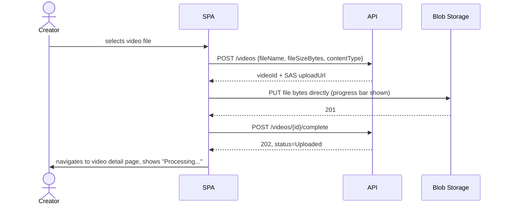
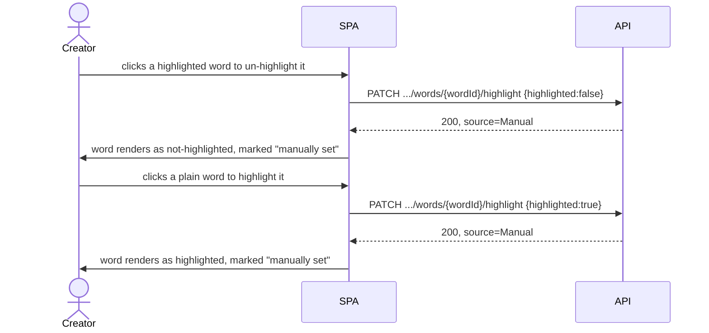
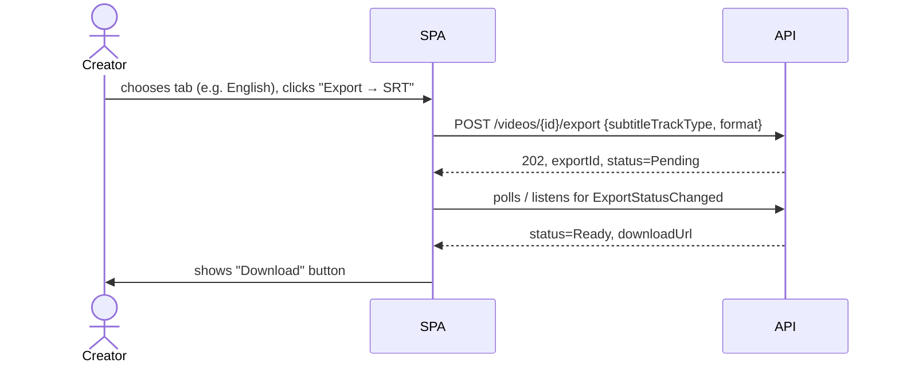

# User Flows

This document walks through how a creator experiences the product,
end to end. Each flow references the API endpoints ([API.md](API.md)) and
data/status fields ([Database.md](Database.md)) involved, so implementation
can trace UI behavior back to the contract.

## 1. Sign up and log in

1. Creator lands on the app, chooses "Sign up," enters email/password/name.
2. SPA calls `POST /auth/register`; on success, stores the returned access
   + refresh tokens and redirects to the dashboard (empty video list).
3. Returning creators use "Log in" → `POST /auth/login`.
4. The SPA silently refreshes the access token via `POST /auth/refresh`
   before it expires, so a creator mid-edit is never logged out
   unexpectedly.

## 2. Upload a video

- Upload happens directly to Blob Storage so the progress bar reflects
  real network transfer to storage, not a hop through the API tier (see
  [Architecture.md](Architecture.md) §2.1).
- If the browser closes mid-upload, the video row exists in `Uploaded`-
  pending state but processing never starts (no `.../complete` call) — the
  creator sees it as an incomplete upload they can retry or discard from
  the video list.

## 3. Processing and status

1. Immediately after upload completes, the SPA calls `GET /videos/{id}`
   (see [API.md](API.md) §2) once to render initial state, then polls it
   on a short interval (e.g. every 3–5 seconds) until the video reaches a
   terminal status. There is no push channel — see
   [Architecture.md](Architecture.md) §6.3 for why polling is the whole
   mechanism, not a fallback.
2. The pipeline (see [Architecture.md](Architecture.md) §2.3) runs its
   stages **in sequence** — audio extraction, transcription, native
   cleanup, English translation, romanization, highlight generation — so
   the creator's overall status is simply `Uploaded` → `Processing` →
   `Ready`; per-track status (below) is where the more granular picture
   lives.
3. Because the pipeline is sequential, the `Native` tab becomes usable
   first — as soon as the `NativeCleanup` stage finishes — while
   `English` and `Romanized` are still catching up behind it. The SPA
   unlocks each tab as its track's status flips to `Ready`, so the
   creator can start reading/correcting Native subtitles without waiting
   for the full pipeline.
4. If `English` or `Romanized` independently fails (e.g. a transient LLM
   provider error on that stage), the creator sees that specific tab
   marked "Failed — retry" while continuing to work in whichever tracks
   succeeded; a failure in one stage does not roll back stages already
   completed.
5. If the video fails at an earlier, blocking stage (audio extraction,
   transcription, or native cleanup — since everything downstream depends
   on them), the video's overall status becomes `Failed` with a message,
   and the creator's only next action is retry or re-upload (no partial
   editor to fall back to, since no track exists yet).

## 4. View and choose an output

1. On the video detail page, three tabs: **Native**, **English**,
   **Romanized** — disabled/spinner-state until their track status is
   `Ready`.
2. Selecting a tab calls `GET /videos/{id}/subtitles?type=...` and renders
   the cue list, each cue showing its text with highlighted words
   emphasized inline.
3. Switching tabs does not change which portion of the video is being
   viewed — cue N in one tab lines up in time with cue N in another (see
   [Database.md](Database.md) §2.6), so a creator can, for example, play
   the video and toggle between Native and English to sanity-check a
   translation against the same moment.
4. A small "generated by" detail (model name and generation time, from
   `generatedBy` in the subtitles response — see [API.md](API.md) §3) is
   available per tab, mainly useful when a creator reports odd output and
   support needs to know which model/prompt version produced it.

## 5. Correct a subtitle line

1. Creator clicks a cue's text to edit it inline.
2. On save, SPA calls `PATCH /videos/{id}/subtitles/{trackType}/cues/{cueId}`
   with the corrected text.
3. The cue immediately shows an "edited" indicator
   (`isManuallyEdited: true`); the original machine-generated text remains
   recoverable (stored server-side, not surfaced in MVP UI beyond the
   indicator — see [Database.md](Database.md) §2.6 on `generated_text`).
4. Editing the **Native** cue text does not automatically re-translate or
   re-transliterate that line in MVP — English/Romanized text for that cue
   stays as originally generated until the creator edits it separately (or
   a future "resync" action is added; see [Roadmap.md](Roadmap.md)). This
   is called out in the UI so creators aren't surprised that a Native fix
   doesn't propagate.

## 6. Adjust highlights

- Highlight decisions are made against the Native transcript and carried
  to English/Romanized (see [Architecture.md](Architecture.md) §2.3 stage
  6), so toggling a word's highlight in one tab is reflected — for the
  corresponding word — when the creator switches tabs, keeping emphasis
  consistent across output types.
- A word marked "manually set" is visually distinguished (e.g. a small
  pin icon) from an auto-highlighted word, so the creator can tell at a
  glance which emphasis choices were theirs vs. the system's.

## 7. Export

- **SRT/VTT export** completes quickly; the SPA may show a brief spinner
  rather than a persistent progress bar.
- **Burned-in video export** (`BurnedInMp4`) is explicitly framed in the UI
  as slower ("this can take a few minutes for longer videos") because it
  re-encodes the full video via FFmpeg — the creator is not blocked from
  navigating away; the export shows up as "in progress" in an exports
  list they can return to.
- Every export is tied to one specific output type at the time of export
  (§4) — exporting again after further manual edits produces a new export
  reflecting the latest state, not a live-updating file.

## 8. Delete a video

1. From the video list, creator selects "Delete."
2. Confirmation dialog (destructive, hard-to-reverse — flagged explicitly
   in the UI) since this removes access to transcripts/subtitles/exports
   for that video.
3. `DELETE /videos/{id}` soft-deletes; video disappears from the list.

## 9. Error recovery patterns (cross-cutting)

- Any pipeline stage failure surfaces a "Retry" action scoped to what
  actually failed (a track, an export, or the whole video) rather than
  forcing a full re-upload, consistent with the idempotent-stage design in
  [Architecture.md](Architecture.md) §2.4.
- Low-confidence language detection (see
  [ProductRequirements.md](ProductRequirements.md) §6.2) surfaces as a
  banner on the video detail page offering a manual language override
  before transcription proceeds, rather than silently transcribing with
  the wrong language model.
